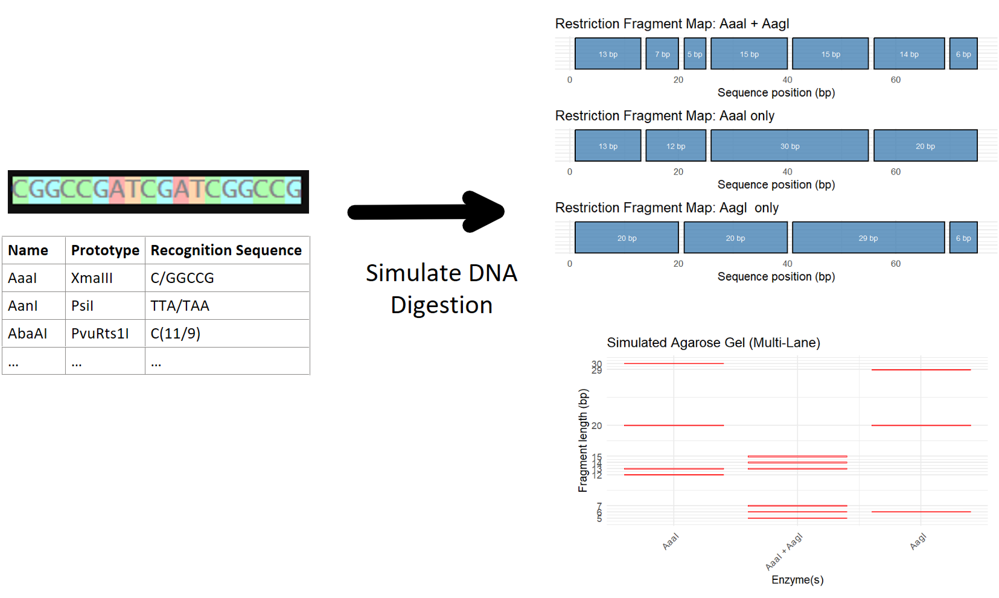

<!-- README.md is generated from README.Rmd. Please edit that file -->

# REDesignR

<!-- badges: start -->

<!-- badges: end -->

## Description

The goal of REDesignR is to help scientists determine the best
restriction enzyme(s) to use for their sequence digestion experiment.
The tool will be an R package with a Shiny interface that simulates and
visualizes restriction enzyme digestion experiments. While web
interfaces like REBASE (Roberts, 2015) exist to help with optimal
restriction enzyme choice and packages like DECIPHER (Wright, 2024) can
simulate the fragments that results from digesting a given sequence with
the specified restriction enzyme, these existing tools lack in providing
comparisons to aid in optimal enzyme choice, providing intuitive
visualization/interactive interfaces, and simulating multi-enzyme
digestion (using multiple restriction enzymes to digest a single
sequence) experiments that many scientists choose to do. Additionally,
certain R packages like *REDseq* (Zhu et al., 2025) and web tools like
*NEBcutter* (*NEBcutter 3.0.*, n.d.) help visualize digests as
restriction maps, not many tools provide visualizations simulating an
agarose gel. However, one of the most common ways scientists validate
their wet lab results is using agarose gels. This is a critical step in
ensuring the digestion performed as expected and won’t confound
downstream experiments/results. Thus having an *in silico* simulation of
these validation tests could prove to be a useful representation of
expected results.

‘REDesignR’ was developed using R version ‘4.5.1’, platform
‘x86_64-w64-mingw32/x64’, and running under ‘Windows 11 x64 (build
26100)’.

## Installation

To install the latest version of the package:

``` r
install.packages("BiocManager")
BiocManager::install(c("Biostrings", "DECIPHER"))

install.packages("devtools")
require("devtools")

devtools::install_github("christinecheng1229/REDesignR", build_vignettes = TRUE)
library("REDesignR")
```

To run the shinyApp:

``` r
runREDesignR()
```

## Overview

``` r
ls("package:REDesignR") # View package functions and datasets
data(package = "REDesignR") # View package dataset(s)
browseVignettes("REDesignR")  # View package vignette(s)
```

`REDesignR` contains 3 functions.

1.  ***simulateCoDigest*** for simulating a co-digestion experiment and
    producing a table of resulting digests.

2.  ***plotRestrictionMap*** for visualizing the digestion results via
    restriction map.

3.  ***simulateGel*** for visualizing the digestion results via an
    agarose gel.

The package also contains a dataset, called `Enzymes` that can be used
as a source of restriction enzymes and their recognition sites.

Refer to package vignettes for more details.

An overview of the package is illustrated below:


## Contributions

The author of the package is Christine Cheng. The author wrote all of
the `simulateCoDigest` function and associated helper functions, which
made use of the `Biostrings` package for representation and manipulation
of DNA sequences and the `DECIPHER` package for extracting restriction
cut site positions. Input validation is implemented using base R checks,
and all digestion outputs are constructed as tibbles using the `tibble`
package. The `plotRestrictionMap` and associated helper function(s) are
written by the author and made use of the `ggplot2`, `dplyr`, and
`patchwork` packages for creating and manipulating plots. The
`simulateGel` function is also written by the author and makes use of
`ggplot2` to construct plots, `dplyr` for data manipulation, and
`scales` for creating custom scaling. No code was borrowed from external
packages beyond the standard use of their publicly available
functions.OpenAI’s ChatGPT-5.1 model was used during the package
development process to aid in maintaining consistent formatting across R
scripts and identifying gaps in unit test coverage.

## References

- Chang W, Cheng J, Allaire J, Sievert C, Schloerke B, Xie Y, Allen J,
  McPherson J, Dipert A, Borges B (2025). *shiny: Web Application
  Framework for R*. <doi:10.32614/CRAN.package.shiny>
  <https://doi.org/10.32614/CRAN.package.shiny>, R package version
  1.11.1, <https://CRAN.R-project.org/package=shiny>.

- Grolemund, G. (2015). *Learn Shiny - Video Tutorials.*
  <https://shiny.rstudio.com/tutorial/>

- Müller K, Wickham H (2025). *tibble: Simple Data Frames*.
  <doi:10.32614/CRAN.package.tibble>
  <https://doi.org/10.32614/CRAN.package.tibble>, R package version
  3.3.0, <https://CRAN.R-project.org/package=tibble>.

- *NEBcutter 3.0.* (n.d.). Nc3.Neb.com.
  <https://nc3.neb.com/NEBcutter/prj/>.

- OpenAI. (2025). *ChatGPT (GPT-5.1)* \[Large language model\].
  <https://openai.com/chatgpt>

- Pagès H, Aboyoun P, Gentleman R, DebRoy S (2025). *Biostrings:
  Efficient manipulation of biological strings*.
  <doi:10.18129/B9.bioc.Biostrings>
  <https://doi.org/10.18129/B9.bioc.Biostrings>, R package version
  2.78.0, <https://bioconductor.org/packages/Biostrings>.

- Pedersen T (2025). *patchwork: The Composer of Plots.* R package
  version 1.3.2.9000, <https://patchwork.data-imaginist.com>.

- R Core Team (2025). *R: A Language and Environment for Statistical
  Computing*. R Foundation for Statistical Computing, Vienna, Austria.
  <https://www.R-project.org/>.

- Roberts, R.J., Vincze, T., Posfai, J., Macelis, D (2015). *REBASE-a
  database for DNA restriction and modification: enzymes, genes and
  genomes*. Nucleic Acids Res. 43: D298-D299.

- *Shiny - File Download. (2014, July 29).* Shiny.
  <https://shiny.posit.co/r/gallery/widgets/file-download/>‌

- *Shiny - File Upload.* (2014, July 29). Shiny.
  <https://shiny.posit.co/r/gallery/widgets/file-upload/>‌

- Wickham, H. (2016). *ggplot2: Elegant Graphics for Data Analysis.*
  Springer-Verlag New York. ISBN: 978-3-319-24277-4.

- Wickham H, François R, Henry L, Müller K, Vaughan D (2023). *dplyr: A
  Grammar of Data Manipulation*. <doi:10.32614/CRAN.package.dplyr>
  <https://doi.org/10.32614/CRAN.package.dplyr>, R package version
  1.1.4, <https://CRAN.R-project.org/package=dplyr>.

- Wickham H, Pedersen T, Seidel D (2025). *scales: Scale Functions for
  Visualization.* R package version 1.4.0, <https://scales.r-lib.org>.

- Wright ES (2024). “Fast and Flexible Search for Homologous Biological
  Sequences with DECIPHER v3.” *The R Journal*, *16*(2), 191-200.

- Zhu LJ, Li J, Fazzio T (2025). *REDseq: Analysis of high-throughput
  sequencing data processed by restriction enzyme digestion.*
  <doi:10.18129/B9.bioc.REDseq>, R package version 1.56.0,
  <https://bioconductor.org/packages/REDseq>.

## Acknowledgements

This package was developed as part of an assessment for 2025 BCB410H:
Applied Bioinformatics course at the University of Toronto, Toronto,
CANADA. REDesignR welcomes issues, enhancement requests, and other
contributions. To submit an issue,use the GitHub issues.

<!-- ## Package Tree Structure -->

<!-- TODO -->
